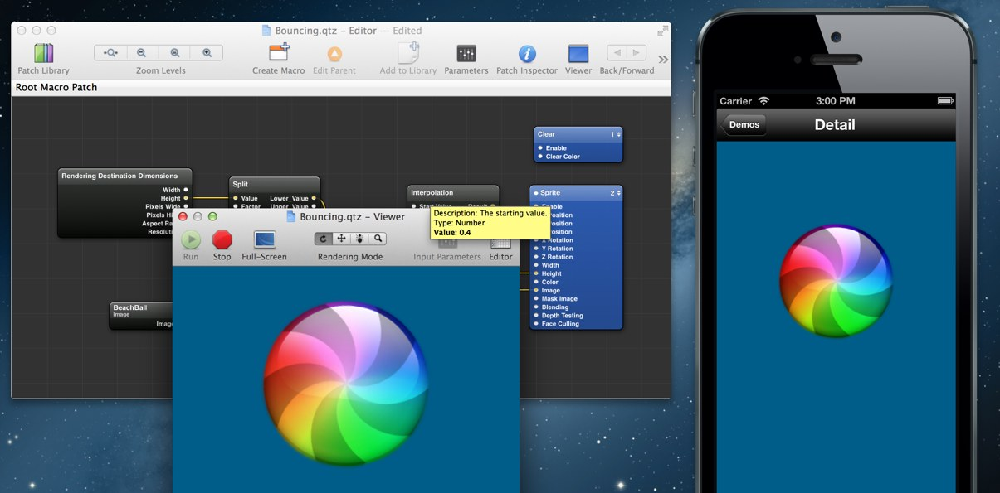

# qc-mobile

A Quartz Composer runtime implementation for iOS. This project makes it possible to load, display and interact with `.qtz` files on iOS.

By **Joris Kluivers**

- See the [introductionary blog post](http://joris.kluivers.nl/blog/2013/06/04/quartz-composer-for-ios/)
- Follow [@kluivers on Twitter][twitter]

## Required frameworks

- QuartzCore
- AVFoundation
- CoreImage
- CoreVideo
- CoreMedia
- CoreText
- OpenGLES
- GLKit

## Other dependencies

- [jk-interpolation][interpolation] - A set of interpolation functions written by me.
- [DDMathParser][math-parser]

### 3rd party demos

- iMessenger composition by [Jay Thrash](http://twitter.com/jaythrash), concept by [Florian Peninon](http://dribbble.com/shots/1048781-iMessage-Concept)

## License

Copyright (c) 2012, Joris Kluivers
All rights reserved.

Redistribution and use in source and binary forms, with or without
modification, are permitted provided that the following conditions are met:

 - Redistributions of source code must retain the above copyright 
   notice, this list of conditions and the following disclaimer.
 - Redistributions in binary form must reproduce the above copyright
   notice, this list of conditions and the following disclaimer in the
   documentation and/or other materials provided with the distribution.
 - Neither the name of the author nor the
   names of any contributors may be used to endorse or promote products
   derived from this software without specific prior written permission.

THIS SOFTWARE IS PROVIDED BY THE COPYRIGHT HOLDERS AND CONTRIBUTORS "AS IS" AND
ANY EXPRESS OR IMPLIED WARRANTIES, INCLUDING, BUT NOT LIMITED TO, THE IMPLIED
WARRANTIES OF MERCHANTABILITY AND FITNESS FOR A PARTICULAR PURPOSE ARE
DISCLAIMED. IN NO EVENT SHALL <COPYRIGHT HOLDER> BE LIABLE FOR ANY
DIRECT, INDIRECT, INCIDENTAL, SPECIAL, EXEMPLARY, OR CONSEQUENTIAL DAMAGES
(INCLUDING, BUT NOT LIMITED TO, PROCUREMENT OF SUBSTITUTE GOODS OR SERVICES;
LOSS OF USE, DATA, OR PROFITS; OR BUSINESS INTERRUPTION) HOWEVER CAUSED AND
ON ANY THEORY OF LIABILITY, WHETHER IN CONTRACT, STRICT LIABILITY, OR TORT
(INCLUDING NEGLIGENCE OR OTHERWISE) ARISING IN ANY WAY OUT OF THE USE OF THIS
SOFTWARE, EVEN IF ADVISED OF THE POSSIBILITY OF SUCH DAMAGE.

[interpolation]: http://bitbucket.org/kluivers/jk-interpolation
[twitter]: http://twitter.com/kluivers
[math-parser]: http://funwithobjc.tumblr.com/post/6196535272/parsing-mathematical-expressions
